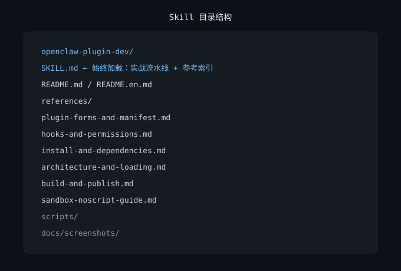
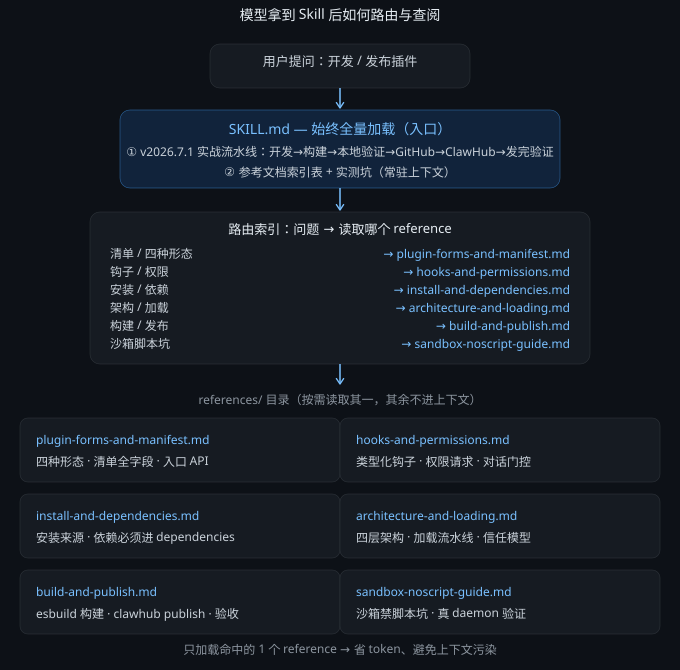

[🇨🇳 中文](README.md) · [🇺🇸 English](README.en.md)

# openclaw-plugin-dev

OpenClaw 插件（extension）**开发流水线与核心难点**指南 skill：从明确目的、配置、构建、本地验证，到先发 GitHub、发 ClawHub、发完验证，全程按官方文档走。

## 解决了什么问题

开发 OpenClaw 插件时，官方文档分散（17+ 篇），且容易踩宿主刻意的安全边界（sandbox / 权限 / iframe）。本 skill 把真实插件实测可跑的流水线沉淀下来，并按官方文档把四种插件形态、清单全字段、钩子与权限、安装依赖、架构加载、构建发布梳理进 `references/`——**每段都标注官方出处**，让 agent 照着做就能少走弯路。

## 效果展示





## 安装

**方式一：ClawHub（发布后）**

发布到 ClawHub 后，用一行命令安装：

```bash
clawhub install <你的 owner>/openclaw-plugin-dev
```

> 注意：ClawHub 上 `openclaw-plugin-dev` 这个 slug 已被社区同名 skill 占用，发布前会改名或加 owner 区分，安装命令以发布后的实际名称为准。

**方式二：手动放置**

把本仓库的 `openclaw-plugin-dev/` 目录拷到你的 OpenClaw skills 目录即可，无需额外启用步骤，skill 立即可用。

## 使用

1. 在对话里让 agent「开发 / 调试 / 发布一个 OpenClaw 插件」，本 skill 自动激活。
2. `SKILL.md` 始终加载，提供实测流水线总览与参考索引；`references/` 下 6 个文件按需读取，只加载命中主题的那个。
3. 按问题直接查对应文件：

| 你想做的事 | 看哪里 |
|---|---|
| 做工具插件 / 下一步怎么走 | `SKILL.md` 流水线 → 必要时 `references/plugin-forms-and-manifest.md` |
| 填 manifest / 区分四种形态 | `references/plugin-forms-and-manifest.md` |
| 加 hook / `before_tool_call` 拦截 | `references/hooks-and-permissions.md` |
| 安装插件 / 依赖报缺 | `references/install-and-dependencies.md` |
| 排查加载失败 / 理解架构 | `references/architecture-and-loading.md` |
| 发 ClawHub / 构建报错 | `references/build-and-publish.md` + `SKILL.md` 流水线后半段 |
| sandbox 里脚本跑不了 | `references/sandbox-noscript-guide.md` |

4. 每个 reference 段落都贴了官方文档出处（`docs.openclaw.ai/zh-CN/plugins/...`），需要权威细节时直接点链接核对。

## 许可证

MIT
